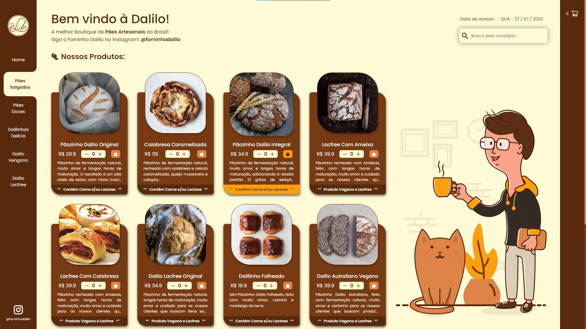
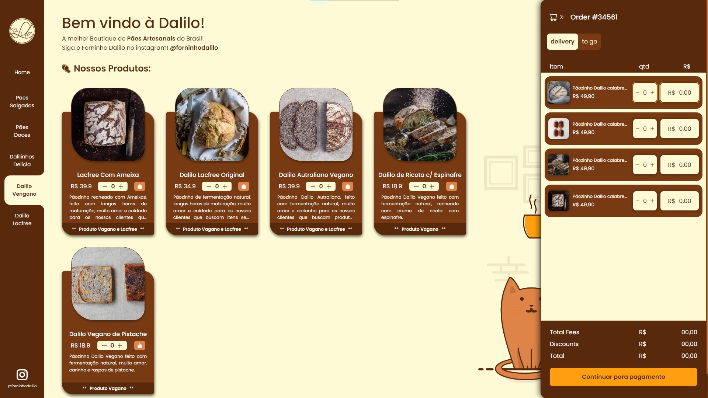

<h1> DaliloBakery </h1>

<h3>[🚧 Under Construction...]</h3>

    [x] Design with Figma 
    
    [ ] Build Frontend with React + Sass
        
        [X] Home page frontend
        [ ] Checkout page frontend
        [ ] Order Confirmation page frontend
        
    [X] Create Routes schema ( Checkout [X] | Confirmation [ ] )
      
    [ ] Implement to the app all main functionalities
    
        [ ] Main Dashboard
        
            [X] Product filter Menu    
            [ ] Shopping Cart Context
            [ ] Backend Connection
            [ ] Product finder

        [ ] Checkout Page
    
            [ ] Shopping cart review 
            [ ] Redirect to stirpe payment API page
            [ ] Redirect to Order Confirmation Page

    [ ] Implement a responsive design

<h3>Here some Screenshots and GIFs of how this project is going...</h3>

 
    
    

