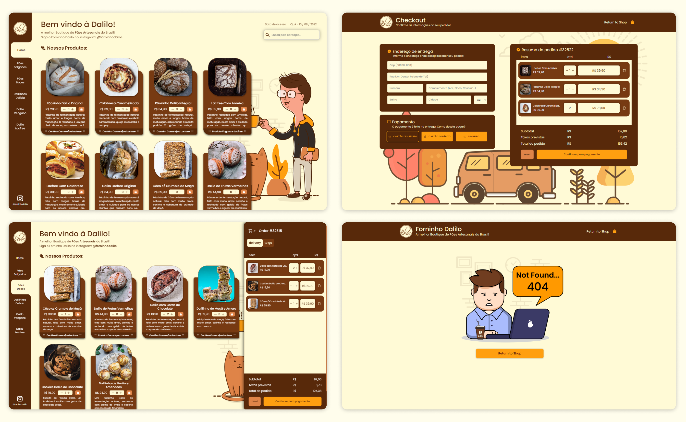

<h1> DaliloBakery </h1>

<h3>[🚧 Under Construction...]</h3>

<h4>If you want to access the project's mockup, <a href="https://dalilobakery.netlify.app/">check it out here</a>.</h4>

    [x] Design with Figma 
    [X] Create Routes schema ( Checkout [X] | Confirmation [X] | [X] NOT FOUND )
        [X] Checkout
        [x] Confirmation
        [x] 404    
    [ ] Build Frontend with React + Sass
        [X] Home page frontend
        [X] Checkout page frontend
        [X] Not Found page frontend
        [ ] Order Confirmation page frontend
    [ ] Implement to the app all main functionalities
        [ ] Main Dashboard
            [X] Product filter Menu    
            [X] Shopping Cart Context
            [X] Product finder
            [ ] Backend Connection
        [ ] Checkout Page
            [X] Shopping cart review 
            [ ] Redirect to stirpe payment API page
            [ ] Redirect to Order Confirmation Page
    [ ] Implement a responsive design

<h3>Here some Screenshots and GIFs of how this project is going...</h3>

<h2 id="GettingStarted">GettingStarted</h2> 

Firt, clone this repo, access the project diretory and install all dependencies. For this, follow the terminal commands bellow.

    $ git clone git@github.com:RafaelMariscal/DaliloBakery.git
    $ cd DalioBakery
    $ yarn

To actualy run this project, use de development tool by running the following terminal command line:
    
    $ yarn dev

The project will be hosted at ``localhost:3000``

<h2 id="Contributing">Contributing</h2>

You can send how many PR's do you want, I'll be glad to analyse and accept them! And if you have any question about the project...

Email-me: <a href="mailto: rafael_mariscal_@outlook.com">rafael_mariscal_@outlook.com</a>

Connect with me at  <a href="https://www.linkedin.com/in/rafael-mariscal/">LinkedIn</a>

Thank you!
